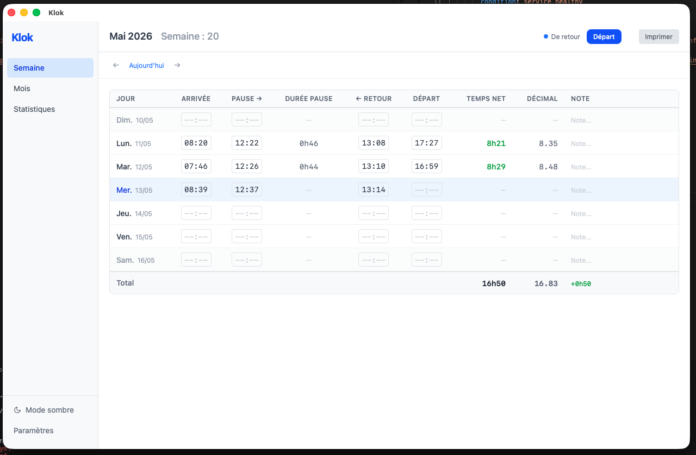
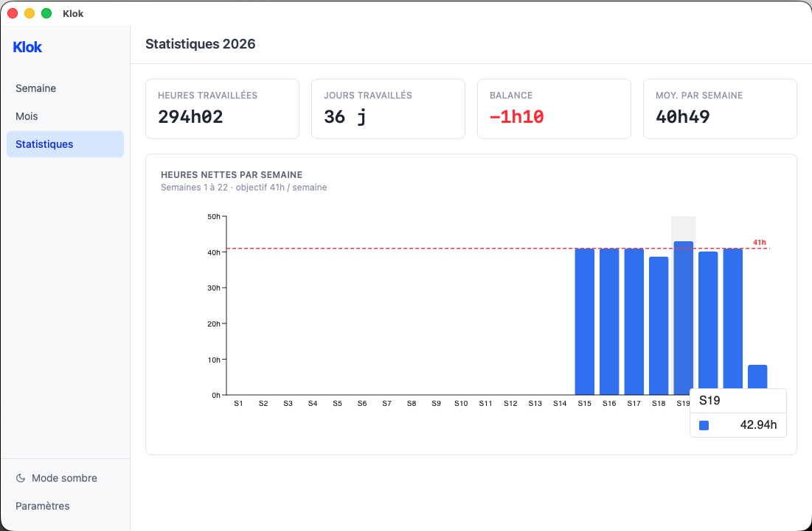

# Klok

> A minimal time tracking app for macOS.


## Screenshots

| Weekly view | Statistics |
|---|---|
|  |  |

## Features

- **Week and month views** — arrival, break start/end, departure, net hours, balance per day
- **Public holidays** — mark any day as a holiday; it counts toward your expected hours automatically
- **Vacation tracking** — dedicated page modelled on the Swiss system (4, 5 or 6 weeks per year: 20 / 25 / 30 days); mark any day as a vacation day from the row menu and it counts toward your expected hours
- **Per-row dropdown** — a single ⋮ button in each day row exposes both "mark as holiday" and "mark as vacation"
- **Statistics page** — weekly bar chart for the current year, with total hours, worked days, balance, weekly average, and vacation taken / remaining
- **Expected hours per week** — configurable target (default 37.5h), used to compute daily and weekly balance
- **Notes** per day entry
- **i18n** — French / English, switchable from the sidebar
- **Dark mode** — toggle in the sidebar, persisted across sessions
- **Print** week or month to PDF via the native print dialog
- **SQLite** — all data stored locally in `~/Library/Application Support/com.klok.app`
- Runs quietly in the menu bar; closing the window keeps it alive in the background

## Stack

| | |
|---|---|
| [Tauri v2](https://tauri.app) | Rust backend, WebKit renderer |
| React 19 + TypeScript | UI |
| Tailwind CSS v4 | Styling |
| Zustand | State management |
| `tauri-plugin-sql` | SQLite access |
| MUI X Charts | Statistics chart |

## Development

```bash
npm install
npm start          # launches tauri dev + vite HMR on :1420
```

Requires [Rust](https://rustup.rs) and the [Tauri prerequisites](https://tauri.app/start/prerequisites/) for your platform.

## Build

```bash
npm run build        # tsc + vite bundle
npm run tauri build  # produces .app / .dmg in src-tauri/target/release/bundle
```
